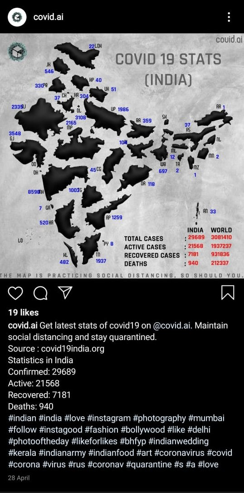

# Covid19-InstaBot

The Bot posts the live corona virus cases in each state in India to Instagram account. The post also includes captions in 10 different languages

The captions include total cases, active cases, recovered and deaths. The post is optimized with hashtags which are most trending in india and related to covid19.

API used for covid stats
> https://api.covid19india.org/data.json

## Template used 


## Languages

english, hindi, gujarati, marthi, tamil, malayalam, kannada, bengali and telugu.

## Captions

Get latest stats of covid19 on @covid.ai. Maintain social distancing and stay quarantined.<br />
Source : covid19india.org<br />
Statistics in India<br />
Confirmed: 29689<br />
Active: 215689<br />
Recovered: 7181<br />
Deaths: 940<br />
(Trending hashtags)

## Post on Insta


#
## How to post on Instagram

### Setup

```
pip install -r requirements.txt
```
### Posting

```
python bot.py username password lang
```
where username and password are your instagram account password.<br />
lang represents the language of captions from keywords [here](#languages)

## For automatic posting

Use crontab for scheduling the posts eg at every 11 am

```
crontab -e
(add this line at last) 

0 11 * * * cd /home/covid19/covid19-instabot && . env/bin/activate && python bot.py
```

Note - Dont try to post more frequently, it may block your account